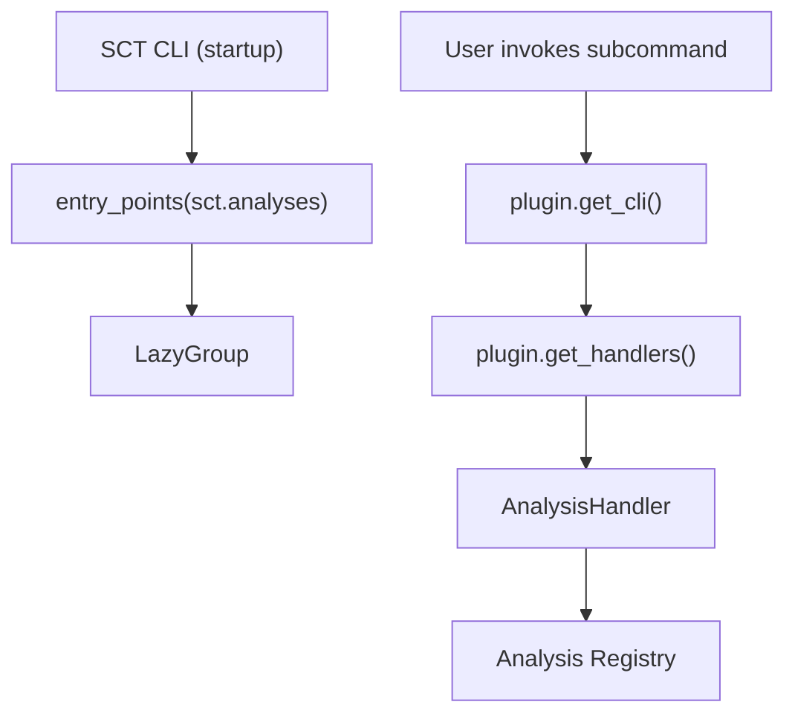

# Internal Structure

Every analysis plugin must satisfy the ``sct.plugins.protocols.AnalysisPluginProtocol``.
The protocol is intentionally input-agnostic: each plugin defines, validates and
provides its own inputs, configuration, CLI and testing hooks.

<figure markdown="span">
    { width="850" }
    <figcaption>Plugin architecture and SCT protocol compliance.</figcaption>
</figure>

A minimal implementation looks like the following:

```python title="SCT Plugin Compliant Class"

from __future__ import annotations

from typing import TYPE_CHECKING, Callable

from sct_<analysis_name>_analysis import __version__  # (1)!

if TYPE_CHECKING:
    from sct.core.base import AnalysisHandler
    from typer import Typer

ANALYSIS_NAME = "<analysis_name>"


class <AnalysisName>AnalysisPlugin:  # (2)!

    version = __version__
    short_help = "<Short description of the analysis>"

    @classmethod
    def get_cli(cls) -> Typer | Callable:
        from sct_<analysis_name>_analysis.cli import analysis_command

        return analysis_command

    @classmethod
    def get_handlers(cls) -> dict[str, AnalysisHandler]:
        from sct.core.base import AnalysisHandler, AnalysisTestingHandler

        from sct_<analysis_name>_analysis.config import MyAnalysisConfig
        from sct_<analysis_name>_analysis.testing import (
            run_api,
            run_cli,
            validate_results,
        )

        return {
            ANALYSIS_NAME: AnalysisHandler(
                config=MyAnalysisConfig,
                cli=cls.get_cli(),
                testing=AnalysisTestingHandler(
                    api_runner=run_api,
                    cli_runner=run_cli,
                    validator=validate_results,
                ),
            )
        }
```

1.  Substitute ``<analysis_name>`` with  
    the name of the analysis.
2.  Substitute ``<AnalysisName>`` with  
    the name of the analysis.

The plugin is responsible for:

- Exposing a **CLI command** that SCT can register in its top-level interface.
- Providing an **analysis handler** that bundles configuration, CLI and testing together.
- Keeping the **entry-point module lightweight** so importing it does not pull in the scientific stack.

The ``version`` attribute should contain the version of the plugin package. This is typically imported from the package init.

The ``short_help`` attribute provides a one-line description shown in the SCT CLI help output.

Keeping track of the plugin version helps SCT:

- ensure compatibility between plugins and the core framework
- improve reproducibility of analysis results
- assist debugging and reporting

## Deferred Imports

The entry-point module (typically ``interface.py``) **must not** import the heavy analysis
implementation or the scientific stack at module level. All heavy imports are deferred
inside the accessor methods. This is why:

- ``TYPE_CHECKING`` guards are used for type hints that would otherwise require heavy imports.
- ``get_cli()`` imports the CLI module only when the command is actually invoked.
- ``get_handlers()`` imports the config and testing modules only when the handler is needed.

This pattern ensures that ``sct --help`` remains fast and that plugins can be discovered
without loading their dependencies.

## Analysis Handler

The class method ``get_handlers()`` must return a dictionary mapping analysis type names
to ``sct.core.base.AnalysisHandler`` instances.

```python title="AnalysisHandler definition"
@dataclass
class AnalysisHandler:
    config: Any
    cli: Typer | Callable | None
    testing: AnalysisTestingHandler | None
    cli_group_name: str | None = None
```

Each handler bundles the following concerns:

- **``config``**: the configuration class for the analysis (must implement ``AnalysisConfigABC``).
- **``cli``**: a Typer command or callable that SCT registers as a CLI subcommand.
- **``testing``**: an ``AnalysisTestingHandler`` that defines how to run the analysis via API and CLI and how to validate results against a reference.
- **``cli_group_name``**: optional; when set, multiple handlers share the same CLI group instead of each creating its own.

A single plugin may expose more than one analysis type. For example the radiometry plugin
registers four analyses (``nesz``, ``rain-forest``, ``profiles``, ``scalloping``) under the
same ``cli_group_name="radiometry"``.

```python title="Multi-analysis plugin example"
return {
    "radiometry-nesz": AnalysisHandler(
        config=...,
        cli=cls.get_cli(),
        testing=AnalysisTestingHandler(...),
        cli_group_name="radiometry",
    ),
    "radiometry-rain-forest": AnalysisHandler(
        config=...,
        cli=cls.get_cli(),
        testing=AnalysisTestingHandler(...),
        cli_group_name="radiometry",
    ),
    ...
}
```

## Analysis Configuration

The configuration class passed to ``AnalysisHandler.config`` must implement
``sct.configuration.config_abc.AnalysisConfigABC``.

```python title="AnalysisConfigABC definition"
class AnalysisConfigABC(ABC):
    validation_schema: Path
    config_group_name: str

    @classmethod
    @abstractmethod
    def from_dict(cls, arg: dict) -> Self: ...

    @abstractmethod
    def to_dict(self) -> dict: ...

    @classmethod
    def from_toml(cls, file: str | Path) -> Self: ...

    def to_toml(self, out_file: Path) -> None: ...
```

The configuration class:

- Declares a ``validation_schema`` pointing to a JSON Schema file used to validate the TOML configuration.
- Declares a ``config_group_name`` that identifies the section in the global SCT configuration file.
- Implements ``from_dict`` / ``to_dict`` for serialization.
- Inherits ``from_toml`` / ``to_toml`` which read and write TOML files using the core ``GeneralConfiguration`` framework.

## Testing Handler

The ``AnalysisTestingHandler`` dataclass defines how SCT's ``sct testing`` subcommand runs
and validates the analysis.

```python title="AnalysisTestingHandler definition"
@dataclass
class AnalysisTestingHandler:
    api_runner: Callable[[TestParams, Path, Any | None, bool], TestOutput]
    cli_runner: Callable[[TestParams, Path, Path | None, bool], TestOutput]
    validator: Callable[[TestOutput, ReferenceOutput], None]
```

- **``api_runner``**: runs the analysis programmatically, receives the configuration object directly.
- **``cli_runner``**: runs the analysis via CLI invocation, receives a path to the config file.
- **``validator``**: compares the current output against a reference, typically using ``pandas.testing.assert_frame_equal`` with analysis-specific tolerances.

If testing is not implemented, set ``testing=None`` in the ``AnalysisHandler``.

## Registering the Plugin

To allow SCT to discover the plugin automatically, the plugin class must be registered
through a **Python entry point** in the ``sct.analyses`` namespace.

In your ``pyproject.toml`` file:

```toml title="pyproject.toml"

[project.entry-points."sct.analyses"]
<analysis_name> = "sct_<analysis_name>_analysis.interface:<AnalysisName>AnalysisPlugin"
```

Where:

- ``sct.analyses`` is the **entry point namespace** used by SCT for analysis plugins.
- ``<analysis_name>`` is the plugin identifier used as the CLI subcommand name.
- ``sct_<analysis_name>_analysis.interface:<AnalysisName>AnalysisPlugin`` is the import path to the plugin class.

??? info "Example"

    This registers the class ``PointTargetAnalysisPlugin`` as an analysis plugin for SCT.

    ```toml title="pyproject.toml"
    [project.entry-points."sct.analyses"]
    point_target = "sct_point_target_analysis.interface:PointTargetAnalysisPlugin"
    ```

## Plugin Discovery

SCT uses two mechanisms to discover and load analysis plugins:

### CLI Lazy Loading

At startup, the SCT CLI scans the ``sct.analyses`` entry point group using Python's
``importlib.metadata.entry_points``. Each plugin class is loaded **lightly** (only the
``interface.py`` module is imported) and its ``short_help`` is extracted. The actual CLI
command is only loaded when the user invokes the subcommand.

```python title="CLI lazy loading"
from importlib.metadata import entry_points

for entry_point in entry_points(group="sct.analyses"):
    plugin = entry_point.load()
    subcommands[entry_point.name] = _LazySubcommand(
        _analysis_loader(plugin, entry_point.name),
        getattr(plugin, "short_help", ""),
    )
```

This approach keeps ``sct --help`` fast regardless of how many plugins are installed.

### Analysis Registry

When the analysis registry is needed (e.g. for the ``sct info`` command or programmatic
access), SCT uses [OpenStack's stevedore](https://docs.openstack.org/) to load plugins:

```python title="Analysis registration"
from stevedore import ExtensionManager
from sct.plugins.protocols import AnalysisPluginProtocol

manager = ExtensionManager(
    namespace="sct.analyses",
    invoke_on_load=True,
    on_load_failure_callback=_on_load_failure,
)

for extension in manager:
    plugin = extension.plugin
    if isinstance(plugin, AnalysisPluginProtocol):
        for analysis_type, handler in plugin.get_handlers().items():
            register_analysis(analysis_type, handler)
```

The registry is cached after the first load and can be refreshed with ``load_analyses(force=True)``.



## Best Practices

When developing a plugin:

- Keep the **entry-point module** (``interface.py``) **lightweight** – only imports needed for type hints, ideally under ``TYPE_CHECKING``.
- Defer all heavy imports (scientific stack, main logic) to the accessor methods.
- Keep **analysis-specific logic isolated** inside the plugin package.
- Avoid introducing dependencies into the core ``sct`` package.
- Provide **unit tests** using representative product samples.
- Implement the **testing handler** with ``api_runner``, ``cli_runner`` and ``validator``.
- Clearly document the supported product version and sensor.

## Distribution

Plugins can be distributed independently from SCT via PyPI or internal/local package repositories.

This allows users to install only the plugins required for the specific analyses they want to run.
