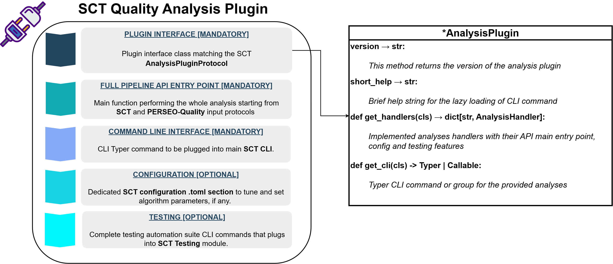

# Introduction

Analyses plugins are python packages that can be used to perform specific quality assessment analysis on SAR L1 products.

The **SCT software itself does not natively support any specific analysis on SAR products**. Instead, it has been
designed to abstract away the dependency on analysis type and its implementation, relying solely on a generic *Python protocol*.
Once this protocol is satisfied, it enables the execution of a given analysis on the provided input product, if the proper
[Product Format plugin is installed](https://opensource.aresys.it/sct_plugins/).

To handle the implementation of the methods and properties defined by the protocol, custom Python packages are used,
each dedicated to a particular analysis. These packages, managed as plugins by the software, are solely responsible
for processing and computing specific parameters, KPI and profiles, ensuring that all the functionalities required by the
protocol are implemented.

This allows:

- New quality analyses to be added without modifying the core SCT code.
- Analyses to interact with a unified interface, regardless of the actual product type.
- Easy distribution of quality analyses plugins as independent packages.

!!! note

    To properly use SCT to perform a specific analysis on a given SAR product, it is necessary to install, in addition to SCT, the
    corresponding analysis plugin and the corresponding [Product Format plugin](https://opensource.aresys.it/sct_plugins/).

## Architecture and internal structure

The plugin architecture is described in detail in the [Plugin Architecture](./architecture/arch.md) section while the
internal structure is described in the [Internal Structure](./architecture/internal.md) section.

<figure markdown="span">
    { width="850" }
    <figcaption>Plugin architecture and SCT protocol compliance.</figcaption>
</figure>

## Benefits

- **Extensibility**: New analyses are supported via independent packages.
- **Decoupling**: Core analysis logic does not depend on product format plugin implementation.
- **Testability**: Plugins can be mocked or substituted without touching the core.
- **Dynamic discovery**: Plugins are discovered at runtime via entry points, no hard-coded imports required.

## Plugin Discovery

Plugins are discovered dynamically using [OpenStack's stevedore](https://docs.openstack.org/).

<figure markdown="span">
    { width="950" }
    <figcaption>Plugin discovery mechanism in SCT.</figcaption>
</figure>

> Refer to the [Plugin Discovery](./architecture/internal.md#plugin-discovery) paragraph for more details.
